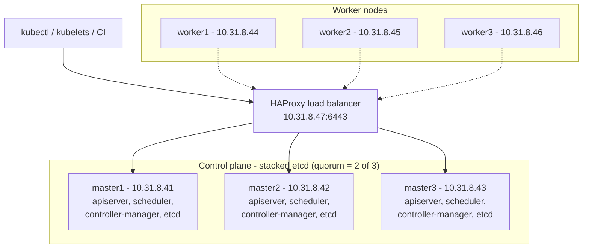

# Kubernetes High Availability Cluster Deployment

A step-by-step guide and config set for building a **highly available Kubernetes cluster with kubeadm** on bare metal or VMs:

- **3 control-plane nodes** with stacked etcd (survives the loss of any 1 node)
- **3 worker nodes**
- **1 HAProxy load balancer** in front of the API server (with an optional Keepalived pair to remove the single point of failure)
- Works on **RHEL 9 / Rocky / AlmaLinux 9** and **Ubuntu 22.04 / 24.04**

Add-ons covered: Calico CNI, MetalLB, Ingress-NGINX, Metrics Server, Helm. Day-2 operations covered: upgrades, node add/remove, etcd backup, safe shutdown/startup, multi-cluster kubeconfig.

---

## Architecture



Every component that talks to the API server (kubectl, kubelets, kube-proxy, controllers) goes through the load balancer address, so losing one control-plane node is invisible to clients.

### Node inventory

| Role | Hostname | IP | Notes |
|---|---|---|---|
| Load balancer | `loadbalancer` | 10.31.8.47 | HAProxy (+ Keepalived, optional) |
| Control plane 1 | `master1` | 10.31.8.41 | Runs `kubeadm init` |
| Control plane 2 | `master2` | 10.31.8.42 | `kubeadm join --control-plane` |
| Control plane 3 | `master3` | 10.31.8.43 | `kubeadm join --control-plane` |
| Worker 1 | `worker1` | 10.31.8.44 | `kubeadm join` |
| Worker 2 | `worker2` | 10.31.8.45 | `kubeadm join` |
| Worker 3 | `worker3` | 10.31.8.46 | `kubeadm join` |

### Versions used

| Component | Version | Notes |
|---|---|---|
| Kubernetes | v1.36 (package repo `pkgs.k8s.io`) | Set via `K8S_MINOR` |
| containerd | from Docker repo (RHEL) / distro (Ubuntu) | `SystemdCgroup = true` |
| Calico | v3.32.0 | Pod CIDR `10.244.0.0/16` |
| Ingress-NGINX | v1.15.1 | See the retirement note in [docs/04](docs/04-addons.md) |
| MetalLB | v0.15.2 | L2 mode |

> Versions move quickly. Check the upstream release pages and pin the versions you actually deploy.

---

## Quick start

1. **Prepare all nodes**: hostnames, swap, SELinux, kernel modules, sysctl, firewall, containerd, kubeadm packages. See [docs/01-os-preparation.md](docs/01-os-preparation.md).
2. **Build the load balancer**: [docs/02-load-balancer.md](docs/02-load-balancer.md), config in [`configs/haproxy.cfg`](configs/haproxy.cfg).
3. **Bootstrap the cluster**: [docs/03-cluster-bootstrap.md](docs/03-cluster-bootstrap.md)
   ```bash
   # on master1
   sudo kubeadm init --config configs/kubeadm-config.yaml --upload-certs
   ```
4. **Install add-ons**: [docs/04-addons.md](docs/04-addons.md)
5. **Operate it**: [docs/05-day2-operations.md](docs/05-day2-operations.md) and [docs/06-troubleshooting.md](docs/06-troubleshooting.md)

---

## Repository layout

```
kubernetes-ha-cluster-deployment/
├── README.md
├── LICENSE
├── .gitignore
├── configs/
│   ├── hosts.example            # /etc/hosts entries for all nodes
│   ├── haproxy.cfg              # API-server load balancer
│   ├── keepalived.conf          # optional VIP for an HA load-balancer pair
│   ├── kubeadm-config.yaml      # cluster definition for kubeadm init
│   └── metallb-pool.yaml        # MetalLB address pool
└── docs/
    ├── 01-os-preparation.md
    ├── 02-load-balancer.md
    ├── 03-cluster-bootstrap.md
    ├── 04-addons.md
    ├── 05-day2-operations.md
    └── 06-troubleshooting.md

```

---

## Security notes

- **Never commit** join tokens, certificate keys, `admin.conf`, or any kubeconfig. The `.gitignore` blocks the common filenames. Treat anything that was ever pasted into a public repo as compromised and rotate it.
- `admin.conf` is a **cluster-admin** credential. For day-to-day use, create scoped users or ServiceAccounts with RBAC.
- Several lab shortcuts are marked in the docs (permissive SELinux, `--kubelet-insecure-tls`, a single load balancer). Each one lists the production alternative.

---

## References

- [Kubernetes: Creating Highly Available Clusters with kubeadm](https://kubernetes.io/docs/setup/production-environment/tools/kubeadm/high-availability/)
- [Kubernetes: Installing kubeadm](https://kubernetes.io/docs/setup/production-environment/tools/kubeadm/install-kubeadm/)
- [Kubernetes: Ports and Protocols](https://kubernetes.io/docs/reference/networking/ports-and-protocols/)
- [Kubernetes: Upgrading kubeadm clusters](https://kubernetes.io/docs/tasks/administer-cluster/kubeadm/kubeadm-upgrade/)
- [Calico documentation](https://docs.tigera.io/calico)
- [MetalLB documentation](https://metallb.io)
- [Helm documentation](https://helm.sh/docs/)


